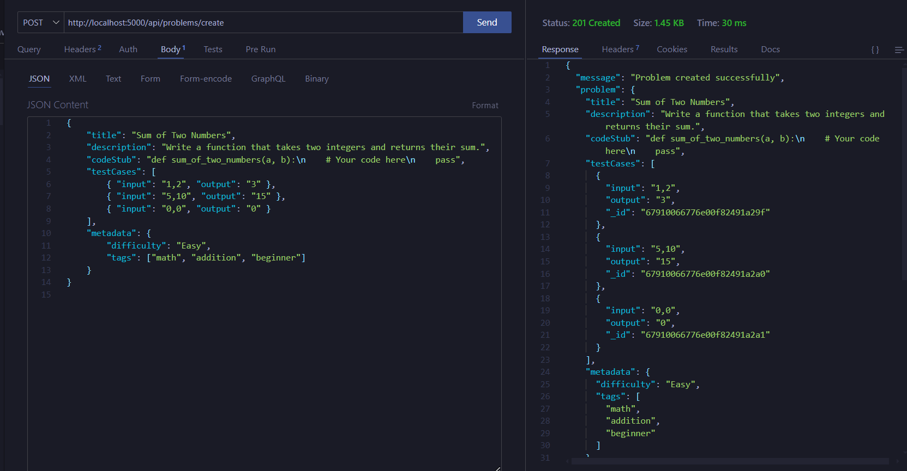
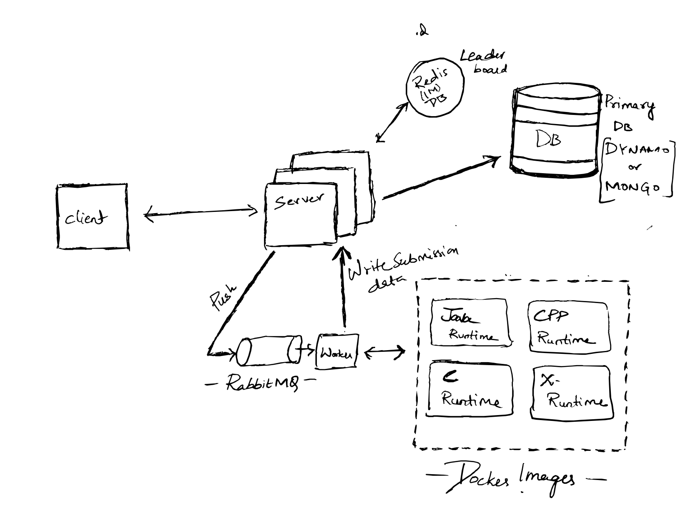

# LeetCode Backend Scaling Showcase

This project demonstrates how LeetCode scales its backend using Docker, RabbitMQ, and language-specific containers. The system includes dynamic problem creation, code submission, and evaluation capabilities.

---

## Prerequisites

Ensure you have the following installed on your machine:
- **Docker** (latest version)
- **Node.js** (16.x or later)
- **RabbitMQ** (via Docker)
- **NPM** (Node Package Manager)

---

## Docker Commands for Setup

### Pull Language-Specific Docker Images
```bash
# Pull the required Docker images
docker pull python:3.9-slim   # Python image
docker pull node:16           # Node.js image
docker pull openjdk:17-slim   # OpenJDK image
docker pull gcc:latest        # GCC image (C and C++)

# Pull RabbitMQ image
docker pull rabbitmq:latest
```

### Run RabbitMQ
```bash
docker run -d --name rabbitmq-container -p 5672:5672 -p 15672:15672 rabbitmq:latest
```

---

## Backend Setup

1. Navigate to the backend folder and install dependencies:
   ```bash
   npm install
   ```

2. Start the server:
   ```bash
   npm run dev
   ```

3. In a separate terminal, start the RabbitMQ consumer:
   ```bash
   node readMQ.js
   ```

---

## Usage Instructions

### Create a Problem

Send a POST request to:
```plaintext
http://localhost:5000/api/problems/create
```

#### Request Body
```json
{
    "title": "Sum of Two Numbers",
    "description": "Write a function that takes two integers and returns their sum.",
    "codeStub": "def sum_of_two_numbers(a, b):
    # Your code here
    pass",
    "testCases": [
        { "input": "1,2", "output": "3" },
        { "input": "5,10", "output": "15" },
        { "input": "0,0", "output": "0" }
    ],
    "metadata": {
        "difficulty": "Easy",
        "tags": ["math", "addition", "beginner"]
    }
}
```

Once submitted, the problem will be saved in the database.




---

### Submit Code for Evaluation

#### Incorrect Code Submission
Send a POST request to:
```plaintext
http://localhost:5000/api/submissions/{problemId}/submit
```

#### Request Body
```json
{
    "code": "def sum_of_two_numbers(a, b):
    return a-b",
    "language": "python"
}
```
[Video on Incorrect Submission results](images/incorrect-submission.mp4)


#### Correct Code Submission
```json
{
    "code": "def sum_of_two_numbers(a, b):
    return a+b",
    "language": "python"
}
```
[Video on correct Submission results](images\correct-submission.mp4)

---

## Workflow Overview

1. **Install Dependencies**:
   - Run `npm install` in the backend folder.

2. **Setup RabbitMQ**:
   - Pull the RabbitMQ image and start the container using the commands provided above.

3. **Run the Server**:
   - Start the server using `npm run dev`.

4. **Run RabbitMQ Consumer**:
   - Use `node readMQ.js` in a separate terminal to start the message queue consumer.

5. **Test the System**:
   - Use the API routes to create problems and submit solutions.

---

## Notes

- The system currently supports only **Python** for code execution.
- Example videos for correct and incorrect submissions can be found in the `images` folder.

---

## API Routes

1. **Problem Creation**:
   - `POST /api/problems/create`
   - Request body should contain the problem details as shown above.

2. **Code Submission**:
   - `POST /api/submissions/{problemId}/submit`
   - Pass the user's solution code and language in the request body.

---

## Technology Stack

- **Node.js**: Backend framework.
- **MongoDB**: Database for storing problems.
- **RabbitMQ**: Message queue for handling code evaluation.
- **Docker**: Containerization for language environments.
- **Python**: Supported language for code evaluation.

---



## License

This project is licensed under the MIT License.
